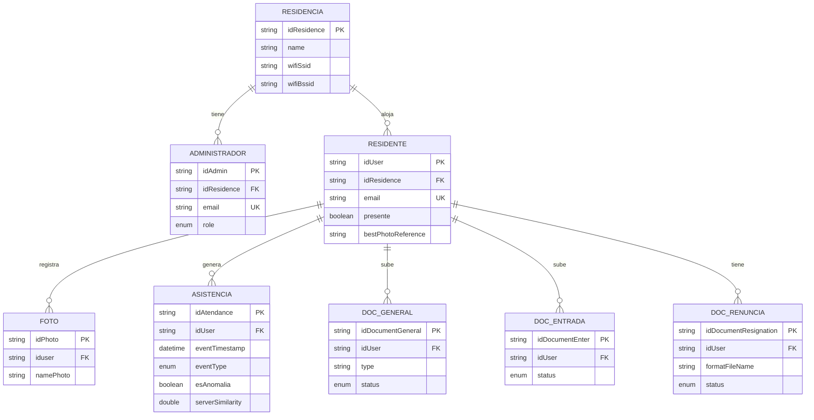

# 7.4 Diseño de Base de Datos

El sistema utiliza **MySQL 8** con motor **InnoDB** y codificación **utf8mb4**. La base
se compone de **8 tablas** que giran en torno a dos actores —la residencia y los
residentes— y registran la asistencia y los documentos.

Las claves primarias son identificadores **UUID** (texto de 36 caracteres) y las
relaciones son de **uno a muchos**, con integridad referencial mediante claves foráneas.

---

## 7.4.1 Modelo Lógico

El modelo lógico describe las entidades, sus atributos y las relaciones entre ellas,
sin depender del gestor de base de datos.

### Diagrama entidad-relación

### Entidades

| Entidad | Representa |
|---------|-----------|
| **RESIDENCIA** | La residencia universitaria. Guarda la red Wi-Fi oficial (SSID/BSSID) que valida la asistencia. |
| **ADMINISTRADOR** | Personal que gestiona el sistema. Dos niveles: `ADMIN` y `SUPER_ADMIN`. |
| **RESIDENTE** | Persona que vive en la residencia y marca asistencia. |
| **FOTO** | Fotos de referencia de un residente para el reconocimiento facial. |
| **ASISTENCIA** | Cada evento de entrada, salida o intento fallido. |
| **DOC_GENERAL** | Documentos del residente (DNI, ficha, pagos, notas…). |
| **DOC_ENTRADA** | Documentos de ingreso del residente. |
| **DOC_RENUNCIA** | Carta de renuncia y el formato en blanco que asigna el administrador. |

### Relaciones y cardinalidad

| Relación | Cardinalidad | Significado |
|----------|:------------:|-------------|
| RESIDENCIA — ADMINISTRADOR | 1 : N | Una residencia tiene varios administradores |
| RESIDENCIA — RESIDENTE | 1 : N | Una residencia aloja varios residentes |
| RESIDENTE — FOTO | 1 : N | Un residente tiene varias fotos de referencia |
| RESIDENTE — ASISTENCIA | 1 : N | Un residente genera muchos eventos de asistencia |
| RESIDENTE — DOC_GENERAL | 1 : N | Un residente sube varios documentos generales |
| RESIDENTE — DOC_ENTRADA | 1 : N | Un residente sube varios documentos de entrada |
| RESIDENTE — DOC_RENUNCIA | 1 : N | Un residente puede tener registros de renuncia |

> **Nota de diseño:** la asistencia sigue un **modelo de eventos** (un registro por
> cada marca) en lugar de una fila por día. Esto permite que un residente entre y salga
> varias veces al día y que se auditen los intentos fallidos.

---

## 7.4.2 Modelo Físico

Implementación concreta en **MySQL 8 / InnoDB / utf8mb4**. El script completo y
ejecutable está en [`modelo-fisico-casaketteler.sql`](modelo-fisico-casaketteler.sql).

**Convenciones:**
- Claves primarias `VARCHAR(36)` (UUID).
- Claves foráneas con `ON DELETE CASCADE` (al eliminar un residente se eliminan sus
  fotos, asistencias y documentos).
- Enumeraciones mediante el tipo `ENUM` de MySQL.
- Fechas de auditoría `created_at` / `updated_at`.

### tresidence
| Columna | Tipo | Clave | Descripción |
|---------|------|:-----:|-------------|
| idResidence | VARCHAR(36) | **PK** | Identificador |
| name | VARCHAR(100) | | Nombre de la residencia |
| idAddress | VARCHAR(45) | | Dirección/IP |
| wifiSsid | VARCHAR(64) | | Nombre de la red Wi-Fi oficial |
| wifiBssid | VARCHAR(64) | | MAC del punto de acceso (valida la asistencia) |
| created_at / updated_at | DATETIME | | Auditoría |

### tadmin
| Columna | Tipo | Clave | Descripción |
|---------|------|:-----:|-------------|
| idAdmin | VARCHAR(36) | **PK** | Identificador |
| idResidence | VARCHAR(36) | **FK** → tresidence | Residencia a la que pertenece |
| firstName / surName | VARCHAR(100) | | Nombres y apellidos |
| email | VARCHAR(150) | **UK** | Correo (único) |
| password | VARCHAR(255) | | Hash BCrypt |
| role | ENUM('SUPER_ADMIN','ADMIN') | | Nivel de permisos |
| active | TINYINT(1) | | Cuenta activa |
| loginAttempts | INT | | Intentos fallidos (bloqueo) |
| lockedUntil | DATETIME | | Bloqueo temporal |
| tokenValidAfter | DATETIME | | Sesión única |
| created_at / updated_at | DATETIME | | Auditoría |

### tuser  (residentes)
| Columna | Tipo | Clave | Descripción |
|---------|------|:-----:|-------------|
| idUser | VARCHAR(36) | **PK** | Identificador |
| idResidence | VARCHAR(36) | **FK** → tresidence | Residencia |
| firstName / surName | VARCHAR(100) | | Nombres y apellidos |
| email | VARCHAR(150) | **UK** | Correo (único) |
| password | VARCHAR(255) | | Hash BCrypt |
| cellPhoneNumber / cellPhoneEmergency | VARCHAR(20) | | Teléfonos |
| ipAddressLocal | VARCHAR(45) | | Última IP registrada |
| role | ENUM('RESIDENTE','ADMIN','GUARDIA') | | Rol |
| active | TINYINT(1) | | Cuenta activa |
| firstLogin | TINYINT(1) | | Exige cambio de contraseña inicial |
| presente | TINYINT(1) | | Dentro/fuera (define la próxima marca) |
| bestPhotoReference | VARCHAR(255) | | Mejor foto para el reconocimiento |
| loginAttempts | INT | | Intentos fallidos |
| lockedUntil | DATETIME | | Bloqueo temporal |
| tokenValidAfter | DATETIME | | Sesión única |
| created_at / updated_at | DATETIME | | Auditoría |

### tphoto
| Columna | Tipo | Clave | Descripción |
|---------|------|:-----:|-------------|
| idPhoto | VARCHAR(36) | **PK** | Identificador |
| iduser | VARCHAR(36) | **FK** → tuser | Residente dueño |
| namePhoto | VARCHAR(255) | | Nombre del archivo |
| extensionPhoto | VARCHAR(10) | | Extensión |
| created_at / updated_at | DATETIME | | Auditoría |

### tattendance  (eventos de asistencia)
| Columna | Tipo | Clave | Descripción |
|---------|------|:-----:|-------------|
| idAtendance | VARCHAR(36) | **PK** | Identificador |
| idUser | VARCHAR(36) | **FK** → tuser | Residente |
| eventTimestamp | DATETIME | | Momento de la marca |
| eventType | ENUM('ENTRADA','SALIDA','INTENTO_FALLIDO') | | Tipo de evento |
| esAnomalia | TINYINT(1) | | Dos eventos iguales seguidos |
| motivoFallo | VARCHAR(255) | | Motivo si fue intento fallido |
| description | VARCHAR(255) | | Motivo declarado por el residente |
| ssid / bssid | VARCHAR(64) | | Red Wi-Fi al marcar |
| serverSimilarity | DOUBLE | | % de coincidencia del rostro |
| created_at | DATETIME | | Auditoría |

### tdocumentGeneral
| Columna | Tipo | Clave | Descripción |
|---------|------|:-----:|-------------|
| idDocumentGeneral | VARCHAR(36) | **PK** | Identificador |
| idUser | VARCHAR(36) | **FK** → tuser | Residente |
| type | VARCHAR(50) | | Tipo (DNI, FICHA, PAGO, NOTAS…) |
| nameDocumentGeneral | VARCHAR(255) | | Nombre del archivo |
| extensionDocumentGeneral | VARCHAR(10) | | Extensión |
| period | VARCHAR(10) | | Periodo ("2026-06" / "2026-1") |
| status | ENUM('PENDIENTE','APROBADO','OBSERVADO','RECHAZADO') | | Estado de revisión |
| observations | VARCHAR(500) | | Observaciones del admin |
| downloadable | TINYINT(1) | | Descargable |
| created_at / updated_at | DATETIME | | Auditoría |

### tdocumentEnter
| Columna | Tipo | Clave | Descripción |
|---------|------|:-----:|-------------|
| idDocumentEnter | VARCHAR(36) | **PK** | Identificador |
| idUser | VARCHAR(36) | **FK** → tuser | Residente |
| nameDocumentEnter | VARCHAR(255) | | Nombre del archivo |
| extensionDocumentEnter | VARCHAR(10) | | Extensión |
| status | ENUM('PENDIENTE','APROBADO','OBSERVADO','RECHAZADO') | | Estado |
| observations | VARCHAR(500) | | Observaciones |
| downloadable | TINYINT(1) | | Descargable |
| created_at / updated_at | DATETIME | | Auditoría |

### tdocumentResignation
| Columna | Tipo | Clave | Descripción |
|---------|------|:-----:|-------------|
| idDocumentResignation | VARCHAR(36) | **PK** | Identificador |
| idUser | VARCHAR(36) | **FK** → tuser | Residente |
| nameDocumentResignation | VARCHAR(255) | | Carta firmada (sube el residente) |
| extensionDocumentResignation | VARCHAR(10) | | Extensión |
| formatFileName | VARCHAR(255) | | Formato en blanco (asigna el admin) |
| formatExtension | VARCHAR(10) | | Extensión del formato |
| formatAssignedAt | DATETIME | | Fecha de asignación del formato |
| status | ENUM('PENDIENTE','APROBADO','OBSERVADO','RECHAZADO') | | Estado |
| observations | VARCHAR(500) | | Observaciones |
| created_at / updated_at | DATETIME | | Auditoría |

### Enumeraciones del sistema

| Enum | Valores |
|------|---------|
| Rol de administrador | `SUPER_ADMIN`, `ADMIN` |
| Rol de usuario | `RESIDENTE`, `ADMIN`, `GUARDIA` |
| Tipo de evento | `ENTRADA`, `SALIDA`, `INTENTO_FALLIDO` |
| Estado de documento | `PENDIENTE`, `APROBADO`, `OBSERVADO`, `RECHAZADO` |

> **Nota:** la base real es generada por el ORM (Hibernate). Este modelo físico
> presenta el diseño de forma limpia y documentada; en la base autogenerada los
> textos usan `VARCHAR(255)` de manera uniforme.

---

## Cómo obtener el diagrama ER en MySQL Workbench

Para el informe conviene un diagrama generado por Workbench. Hay dos formas:

### Opción A — Desde la base de datos real (recomendada)
1. Abre MySQL Workbench y conéctate a tu servidor.
2. Menú **Database → Reverse Engineer…** (`Ctrl+R`).
3. Elige la conexión → *Next* → selecciona el esquema **casaKetteler** → *Next*.
4. Al terminar, Workbench dibuja el **diagrama EER** con todas las tablas y relaciones.
5. Exporta con **File → Export → Export as PNG / PDF** para pegarlo en el informe.

### Opción B — Desde el script de este proyecto
1. Menú **File → Open Model** no; usa **File → New Model**.
2. **Database → Reverse Engineer MySQL Create Script…**
3. Selecciona [`modelo-fisico-casaketteler.sql`](modelo-fisico-casaketteler.sql) → *Execute*.
4. Se genera el diagrama a partir del modelo limpio (sin las columnas heredadas).

> 💡 La **Opción A** refleja la base tal cual está hoy; la **Opción B** produce un
> diagrama más limpio (el script no arrastra columnas antiguas del ORM).
