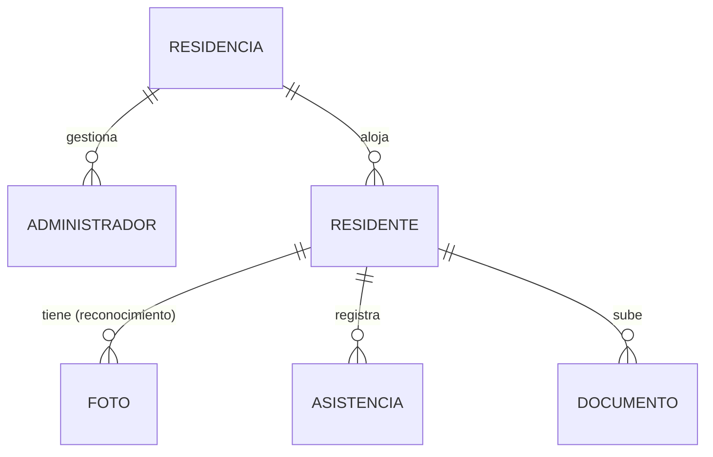

# Validación de requisitos vs. implementación actual

Comparación de la especificación original (6.1–6.5) con **lo que el sistema hace hoy**.
El proyecto evolucionó de forma importante, sobre todo en la arquitectura del
reconocimiento facial.

> ⚠️ **Este análisis usa la numeración ANTERIOR a la actualización.** Es el estudio que
> dio origen a los cambios, así que conserva a propósito los números de entonces: aquí
> RF-07 es la cámara frontal y RF-09 el modelo de eventos, mientras que en la
> especificación vigente son la sesión única y el registro de la marca. Para citar
> requisitos usa la numeración del `.docx`, que es la que siguen la
> [matriz de trazabilidad](MATRIZ-TRAZABILIDAD.md) y el
> [diseño de escenarios](DISENO-ESCENARIOS-UNITARIAS.md).

**Leyenda de estado:**

| Símbolo | Significado |
|:-------:|-------------|
| ✅ | Cumplido tal como se especificó |
| 🔶 | Implementado, pero **diferente** a lo especificado (se indica la realidad) |
| ⚠️ | Parcial o pendiente |
| ❌ | **Ya no aplica** — la arquitectura cambió y este requisito quedó obsoleto |
| ➕ | Nuevo — existe en el sistema y **falta agregarlo** al documento |

---

## ⚠️ Cambios de fondo que hay que reflejar sí o sí

Antes del detalle, tres cambios que contradicen el documento original y **deben
corregirse** para que el informe no choque con la demostración:

1. **El reconocimiento facial NO corre en el dispositivo, corre en el servidor.**
   El documento (RF-34, RF-35, RN-03, RNF-13) describe procesamiento en el celular y
   funcionamiento offline con sincronización diferida. **Eso se abandonó.** Hoy el
   celular envía las fotos a un servicio Python en el servidor (`:5000`), que hace el
   reconocimiento. Requiere estar en la red local con el servidor encendido; **no hay
   marcado offline ni sincronización diferida**.

2. **El umbral pasó de 85% (una foto) a 55% sobre la mediana de una ráfaga de 3 fotos.**
   (RF-13). El 85% con una sola foto daba malos resultados con datos reales; la ráfaga
   + mediana + umbral calibrado es más robusta.

3. **La validación de red usa BSSID (preferente), no solo SSID.** (RF-15, RN-01). El
   BSSID (la MAC del router) es más difícil de falsificar que el nombre de la red.

---

## 6.1 Requerimientos Funcionales

### Gestión de usuarios
| RF | Estado | Realidad actual |
|----|:------:|-----------------|
| RF-01 | ✅ | Login con BCrypt. *Nota:* se usa **email**, no "nombre de usuario". |
| RF-02 | ✅ | Roles `ADMIN` y `RESIDENTE` (además existe `SUPER_ADMIN`; `GUARDIA` está en el enum pero sin uso). |
| RF-03 | ✅ | Verificación de rol por petición (filtro JWT + guards de ruta). |
| RF-04 | ✅ | Crear, editar, desactivar, eliminar y restablecer contraseña: todo implementado. |
| RF-05 | ✅ | Contraseña temporal generada al registrar. |
| RF-06 | 🔶 | El perfil del residente **muestra** sus datos y su foto, pero es de **solo lectura**; la edición de datos propios existe en el backend pero no está expuesta en esa pantalla. |

### Control de asistencia (reconocimiento facial)
| RF | Estado | Realidad actual |
|----|:------:|-----------------|
| RF-07 | ✅ | Activa la cámara frontal (Capacitor). |
| RF-08 | 🔶 | Compara contra el patrón y calcula el % de coincidencia, pero con una **ráfaga de 3 fotos** procesada en el **servidor**, no una sola imagen en el dispositivo. |
| RF-09 | 🔶 | **Modelo de eventos**: un registro por cada marca (no una fila con hora de ingreso/salida). Guarda: timestamp, tipo de evento, residente, estado, IP, motivo, red (ssid/bssid) y % de similitud. |
| RF-10 | 🔶 | El motivo es **obligatorio solo al SALIR**; al ENTRAR es opcional (se asume "Retorno a la residencia"). El combobox con "Otros" + campo de texto: sí. |
| RF-11 | ✅ | Rechaza marcas duplicadas dentro de 5 minutos. |
| RF-12 | 🔶 | Confirmación **visual** (mensaje). La parte **sonora no** está implementada. |
| RF-13 | 🔶 | **Umbral 55% sobre la mediana de la ráfaga**, no 85% de una foto. Resultado medido: residente 78% (aceptado), impostor 0% (rechazado). |

### Restricción por red WiFi
| RF | Estado | Realidad actual |
|----|:------:|-----------------|
| RF-14 | ✅ | Valida la red antes de habilitar el registro. |
| RF-15 | 🔶 | Valida por **BSSID** (preferente) y usa el **SSID** como respaldo, no solo SSID. |
| RF-16 | ✅ | Bloquea solo si no hay red válida; no exige internet. *Matiz:* como el reconocimiento es en el servidor, sí exige estar en la red local con el servidor accesible. |
| RF-17 | ✅ | Muestra mensaje de red válida/inválida. |

### Gestión documental
| RF | Estado | Realidad actual |
|----|:------:|-----------------|
| RF-18 | ✅ | El admin carga y asocia documentos a un residente. |
| RF-19 | ✅ | Categorías por tipo (DNI, ficha, contrato, pagos, notas, renuncia…). |
| RF-20 | ✅ | Lista con visualización y descarga. |
| RF-21 | ✅ | Formulario de constancia de pago (PDF/imagen), con periodo mensual. |
| RF-22 | ✅ | Valida PDF/JPG/PNG, máx. 10 MB, con mensaje de error. |
| RF-23 | ✅ | Constancia de notas con periodo semestral. |
| RF-24 | ✅ | Listado cronológico con fecha y tipo. |
| RF-25 | ✅ | El residente ve solo los documentos marcados como descargables. |
| RF-26 | ✅ | El admin asigna el formato de renuncia. *(Se reparó este ciclo.)* |
| RF-27 | ✅ | El residente descarga el formato asignado. *(Se reparó.)* |
| RF-28 | ✅ | El residente sube la renuncia firmada; queda pendiente de revisión. |
| RF-29 | ✅ | Estados: Pendiente, Aprobado, Observado, Rechazado. |
| RF-30 | ✅ | Observaciones del admin visibles para el residente. |

### Reportes y monitoreo
| RF | Estado | Realidad actual |
|----|:------:|-----------------|
| RF-31 | ✅ | Filtros por fecha, rango, diario/semana/mes, residente y estado. |
| RF-32 | ✅ | Tabla cronológica de ingresos/salidas. |
| RF-33 | ✅ | Exporta a Excel (.xlsx) y PDF. |

### Procesamiento local
| RF | Estado | Realidad actual |
|----|:------:|-----------------|
| RF-34 | ❌ | **No aplica.** El reconocimiento NO se ejecuta en el dispositivo: corre en un servicio Python en el servidor y las imágenes se envían por la red local. |
| RF-35 | ❌ | **No aplica.** Requiere el servidor de reconocimiento en la red local; no opera de forma autónoma en el móvil. |

---

## 6.2 Reglas de Negocio
| RN | Estado | Realidad actual |
|----|:------:|-----------------|
| RN-01 | 🔶 | Correcto, pero validando por **BSSID** (preferente) además del SSID. |
| RN-02 | ⚠️ | La identidad real la garantiza el **reconocimiento facial** (la foto debe coincidir con la del residente). El `idUser` viaja en la petición; no hay un vínculo estricto token↔residente en la marca. |
| RN-03 | ❌ | **No aplica.** No hay almacenamiento offline ni sincronización diferida; el reconocimiento es en el servidor. |

---

## 6.3 Requerimientos No Funcionales
| RNF | Estado | Realidad actual |
|-----|:------:|-----------------|
| RNF-01 | ✅ | RBAC + contraseñas cifradas. |
| RNF-02 | ⚠️ | BCrypt sí; **HTTPS pendiente** (hoy HTTP en red local; queda para el despliegue). |
| RNF-03 | ✅ | Bloqueo temporal tras 5 intentos fallidos. |
| RNF-04 | ✅ | Documentos filtrados por el usuario autenticado. |
| RNF-05 | 🔶 | Reconocimiento en **~3-5 s en el CPU del servidor** (no 2 s en el dispositivo, donde no corre). |
| RNF-06 | ✅ | Consultas con paginación; respuesta rápida. |
| RNF-07 | ⚠️ | Diseñado para escalar; no se probó con 200 residentes simultáneos. |
| RNF-08 | 🔶 | Estilos coherentes por rol y contraste corregido; falta una **guía de estilos formal** documentada. |
| RNF-09 | ✅ | Flujo en 3 pasos: red → captura → confirmación (con motivo si aplica). |
| RNF-10 | ✅ | Mensajes diferenciados de éxito/error, en lenguaje claro. |
| RNF-11 | ✅ | Diseño responsive, con manejo de *safe-area* (notch). |
| RNF-12 | ⚠️ | Depende de la operación; el arranque automático ayuda. No medido formalmente. |
| RNF-13 | ❌ | **No aplica** (no hay sync offline). *Existe otra cosa distinta:* respaldo automático en el servidor. |
| RNF-14 | ✅ | Android 10+ vía Capacitor. |
| RNF-15 | ✅ | Layouts flexibles y unidades relativas. |
| RNF-16 | 🔶 | Backend por **capas** (controller/business/repository); frontend por componentes. Modular, aunque no Clean Architecture/MVVM estricto. |
| RNF-17 | ✅ | Comentarios, convenciones y documentación agregada. |
| RNF-18 | ⚠️ | Modular; la extensión "sin tocar lo existente" no está garantizada. |
| RNF-19 | ⚠️ | Alta precisión medida (residente 78%, impostor 0%), pero sin un estudio formal del 90%. |
| RNF-20 | ✅ | **Anti-spoofing (liveness)** implementado + umbral de confianza (mediana 55%). |
| RNF-21 | 🔶 | La asistencia solo se modifica por funciones administrativas; se registran intentos fallidos y anomalías, pero **no hay una bitácora de auditoría formal** de cambios. |

---

## 6.5 Requerimientos de Integración
| RI | Estado | Realidad actual |
|----|:------:|-----------------|
| RI-01 | ✅ | Integración con MySQL. |
| RI-02 | ✅ | Cámara y ubicación de Android (la ubicación es la que Android exige para leer el SSID/BSSID). |
| RI-03 | ✅ | Exporta a PDF y Excel. |

---

## ➕ Requisitos nuevos — existen en el sistema y conviene agregarlos

Funcionalidades que se construyeron y **no** están en el documento original:

| Nuevo | Descripción |
|-------|-------------|
| **RF-NEW-01 · Sesión única** | Al iniciar sesión se invalidan las sesiones abiertas en otros dispositivos. |
| **RF-NEW-02 · Sesión según rol** | El residente permanece con la sesión iniciada (auto-login en su celular); el administrador **no** (terminal compartido: debe reingresar la contraseña). |
| **RF-NEW-03 · Respaldo automático** | La base de datos se respalda a diario y los archivos (fotos/documentos) semanalmente; el admin puede además respaldar bajo demanda. |
| **RF-NEW-04 · Detección de anomalías** | Dos eventos del mismo tipo seguidos (dos entradas sin salida) se marcan como anomalía para revisión. |
| **RF-NEW-05 · Acceso web del admin** | El administrador entra desde el navegador; el propio backend sirve la interfaz web (sin instalar servidor aparte). |
| **RNF-NEW-01 · Timeout de conexión** | Si el servidor es inalcanzable, la app avisa rápido en vez de quedarse cargando. |
| **RNF-NEW-02 · Nombres legibles** | Los documentos se guardan como `TIPO_Nombre_Apellido_fecha`, no como identificadores ilegibles. |
| **RNF-NEW-03 · Arranque automático** | El sistema se levanta solo al encender la computadora de la residencia. |

---

## 6.4 Requerimientos de Datos (modelo conceptual mínimo)

Entidades esenciales y sus relaciones (el detalle completo está en
[MODELO-BD.md](MODELO-BD.md)).

| Entidad | Atributos clave | Relaciones |
|---------|-----------------|-----------|
| **Residencia** | id, nombre, SSID y BSSID de la red oficial | 1:N con Administrador y Residente |
| **Administrador** | id, nombre, email, rol (`ADMIN`/`SUPER_ADMIN`) | pertenece a una Residencia |
| **Residente** | id, nombre, email, teléfonos, estado presente, mejor foto | pertenece a una Residencia |
| **Foto** | id, archivo | pertenece a un Residente |
| **Asistencia** | id, fecha-hora, tipo (`ENTRADA`/`SALIDA`/`INTENTO_FALLIDO`), motivo, % similitud, red, ¿anomalía? | pertenece a un Residente |
| **Documento** | id, tipo, archivo, estado (`PENDIENTE`/`APROBADO`/`OBSERVADO`/`RECHAZADO`), observaciones | pertenece a un Residente (general, de entrada o renuncia) |

**Reglas de datos:**
- Cada Residente y Administrador pertenece a **una** Residencia.
- La Asistencia es un **evento** (varios por día por residente), no un resumen diario.
- Al eliminar un Residente se eliminan en cascada sus fotos, asistencias y documentos.

---

## Resumen para el informe

| | Cantidad |
|--|:--:|
| Requisitos ✅ cumplidos | 33 |
| Requisitos 🔶 cambiados (actualizar redacción) | 13 |
| Requisitos ⚠️ parciales/pendientes | 9 |
| Requisitos ❌ obsoletos (quitar o replantear) | 5 |
| Requisitos ➕ nuevos (agregar) | 8 |

**Acción principal:** replantear la sección de *Procesamiento Local* (RF-34, RF-35,
RN-03, RNF-13) — describe una arquitectura en el dispositivo que se reemplazó por
reconocimiento en el servidor. Y actualizar el umbral (RF-13) y la validación de red
(RF-15) a lo que el sistema hace hoy.
